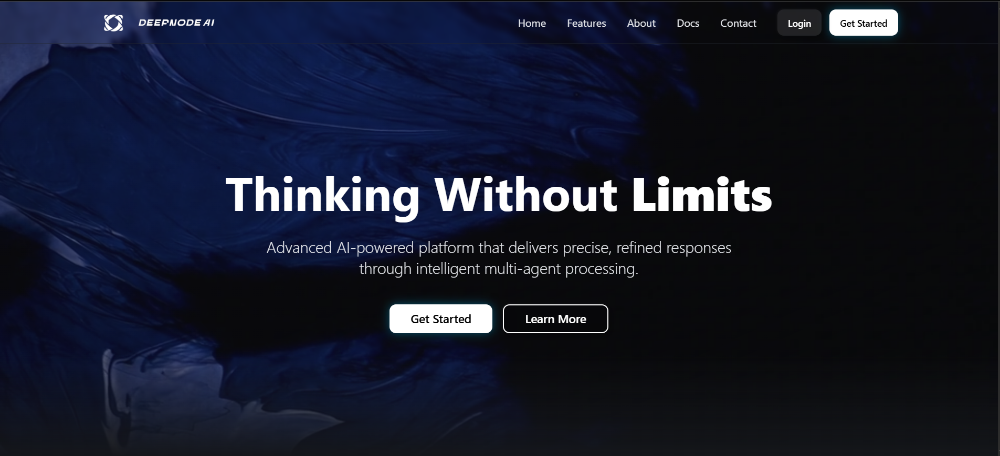
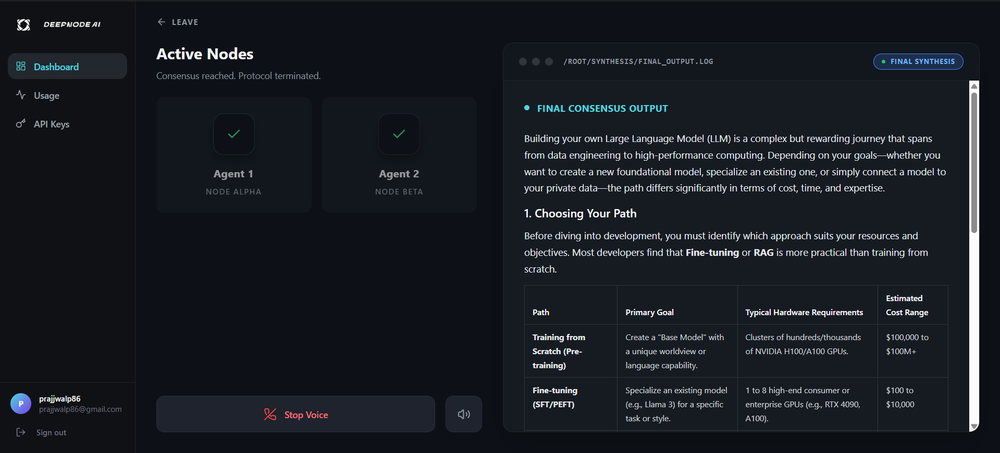
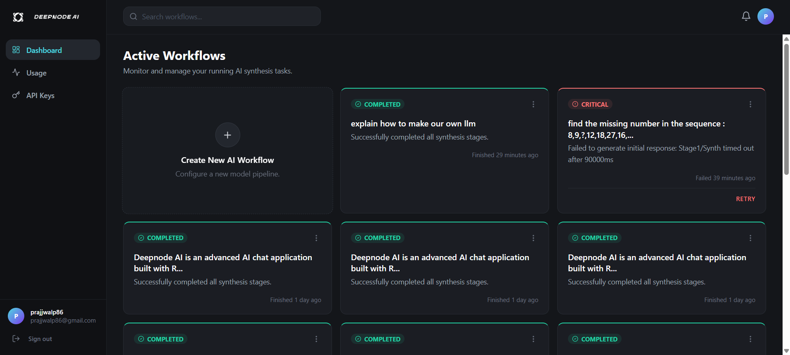

# 🌐 Deepnode AI by AIONIX

> **🤖 The most advanced frontier AI orchestration engine** powered by a **real-time multi-agent debate system** 🔥  
> Orchestrating leading models through adversarial debate and synthesis for the deepest truth and highest quality solutions.

---

## 👨‍💻 About the Creator

Built entirely by **AIONIX** (@anshownn on X), a passionate builder obsessed with pushing the absolute boundaries of artificial intelligence logic.

Deepnode AI is the vision of **next-level AI interaction**: instead of relying on a single model's zero-shot output, multiple top-tier AIs **collaborate, debate, critique, and synthesize** together in real time. The result? Coherent, factual, unbiased, and dramatically better output.

This is the cutting-edge architecture for AI in 2026.

---

## ✨ What is Deepnode AI?

Deepnode AI is a **proprietary, closed-source AI orchestration platform** that connects you to **multiple frontier AI models** (ChatGPT, Claude, Gemini, Grok, and DeepSeek) inside one robust pipeline.

What makes it unparalleled? The **sophisticated multi-agent debate system** — models argue, improve each other's answers across multiple rounds, and deliver a final synthesized response that is rigorously researched and highly superior.

Designed as an enterprise-grade backend architecture with rich UI telemetry, it features real-time visualization, message history, and robust security for API credentials. 

**Your private, closed-ecosystem AI debate arena.**

---

## 💡 How Deepnode AI Helps You

| Benefit                  | How Deepnode AI Delivers It                        
|--------------------------|---------------------------------------------------|
| **Higher quality answers** | Multi-model debate catches errors & fills gaps   |
| **Best for heavy logic**   | Cures hallucinations and logic breakdowns        |
| **Saves hours**            | No more manual cross-referencing between AIs     |
| **Full Telemetry**         | Inspector scoring for logic, facts, and bias     |
| **Secure & Private**       | Closed-source ecosystem; your keys & data remain yours | 

---
## 📸 Screenshots

Here's what Deepnode AI looks like in action:

### 1. Professional Landing Page

### 2. Chat Interface with Real-time Visualization

### 3. Processing Modes & Model Selection

---

## 🔄 How It Works (Step by Step)

1. **Select Your Roster** — Pick a designated Synthesiser model and multiple Debate Agents.
2. **Configure Pipeline** — Choose from Easy, Medium, or Hard processing modes.
3. **Submit a Query** — Enter your complex coding task, logic puzzle, or research request.
4. **The Debate Phase** — Watch the magic live as agents critique flaws and strengthen arguments.
5. **Inspector Scoring** — Deepnode AI evaluates health metrics (Logic, Facts, Bias).
6. **Final Synthesis** — Get the ultimate refined answer + full debate trajectory tracking.

---

## ⚙️ Processing Modes at a Glance

| Mode   | Debate Rounds | Depth | Best For                     |
|--------|---------------|-------|------------------------------|
| **Easy**   | 1 rounds     | Light     | Quick verifications & standard logic |
| **Medium** | 3 rounds     | Balanced  | Most everyday deep tasks & code |
| **Hard**   | 5 rounds     | Deep      | Complex architectural design & deep reasoning |

---

## 🤖 Supported AI Models

| Provider | Supported Frontiers | Known For |
|----------|---------------------|-----------|
| **OpenAI**   | ChatGPT (GPT-4o, GPT-5.4, o3/o4) | Versatility & creativity |
| **Anthropic**| Claude (Opus, Sonnet, Haiku) | Reasoning & careful analysis |
| **Google**   | Gemini (Flash, Pro, Lite) | Multimodal & real-time info |
| **xAI**      | Grok (Fast, Reasoning, Code) | Technical & unvarnished honesty |
| **DeepSeek** | DeepSeek (V3, R1) | Open-weights coding & math excellence |

---

## 🧩 The Magic Behind Deepnode AI (High-Level Architecture)

Deepnode AI runs a **4-stage intelligent pipeline** mapped via strict schema validation:

1. **Stage 1: Initial Generation** — Parallel generation of the first stance from all selected Debate Agents.
2. **Stage 2: Multi-Round Debate** — Sequenced cross-examination and refinement (Pro/Con logic tests).
3. **Stage 3: Inspector Analysis** — Telemetry scoring across Logic Coherence, Factual Alignment, and Bias Deviation.
4. **Stage 4: Final Synthesis** — The Synthesiser actively reviews the entire history to output the definitive response.

Everything happens securely on the backend orchestrations. Real-time processing jobs track token runtimes, API latency, and provider success rates.

---

## ⭐ Key Features

- ✅ Multi-model support framework
- ✅ Real-time automated adversarial debate pipeline
- ✅ Live visualization of every compute stage
- ✅ Configurable multi-round difficulty modes 
- ✅ Automatic telemetry for hallucination prevention
- ✅ MongoDB centralized tracking isolated per user account
- ✅ Bank-grade security for proprietary APIs and closed-source integrity
- ✅ Optimized strictly for high-fidelity code & reasoning

---

## 🔒 Privacy & Security

As a proprietary ecosystem, Deepnode AI is built specifically for **closed-source enterprise-level security**. 
- Your provider keys are actively isolated on a per-user basis.
- **Data Governance:** All chat histories, generated codebases, and debate logs belong strictly to you.
- **Zero Public Exposure:** There is no public telemetry; Deepnode AI ensures your enterprise architectures stay private.

---

## ❓ Frequently Asked Questions

**Q1. Is Deepnode AI open source?**  
No. Deepnode AI is a highly protected, proprietary closed-source engine by AIONIX.

**Q2. Are my API Keys safe?**  
Yes. Deepnode AI's backend is structured to isolate API keys deeply away from client-side vulnerability.

**Q3. How is it different from normal LLM wrappers?**  
Wrappers return a zero-shot generated answer. Deepnode AI forces models to cross-examine *each other's* logic blindly before synthesizing an answer. The result is unrecognizably higher quality.

**Q4. Can I use it for serious coding and infrastructure?**  
Absolutely. It's expressly tuned for providing complete, functional implementations that have survived rigorous model peer-review.

---

## 🚀 Roadmap

- [ ] Further fine-tuning of the Inspector stage to actively weigh historical benchmark fidelity.
- [ ] Incorporating specialized "Research" agents with standalone web-crawling sub-routines.
- [ ] Exclusive waitlist intake for `nodel-1`.

---

Built with ❤️ by **AIONIX**  
[deepnode.onrender.com](https://deepnode.onrender.com) | [@anshownn](https://x.com/anshownn)
